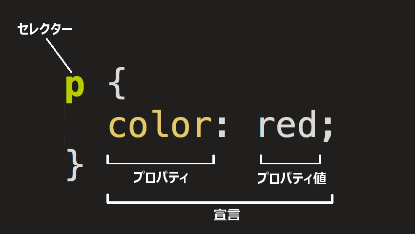

# CSS study

[CSS 基礎学習サイト](https://developer.mozilla.org/ja/docs/Learn/Getting_started_with_the_web/CSS_basics)


HTML のように、CSS は本当のプログラミング言語ではありません。またマークアップ言語でもありません。CSS はスタイルシート言語です。  
和 HTML 类似，CSS 也不是真正的编程语言，甚至不是标记语言。CSS 是一门样式表语言，这也就是说人们可以用它来选择性地为 HTML 元素添加样式。

- ここでは、テキストを赤くするにはどうすればいいのか？コンテンツを（ウェブページの）レイアウトの中で特定の場所に表示するにはどうすればいいのか？背景画像と色を使って ウェブページをどのように飾るのか？というような疑問に答えていきます。  
- 本节将介绍 CSS 的基础知识，并解答像这样的问题：怎样将文本设置为红色？怎样将内容显示在屏幕的特定位置？怎样用背景图片或颜色来装饰网页？

## CSS ルールセットの構造
`.html`と異なり、単独に`.css`ファイルに保存します。  
全体の構造はルールセットと呼びます（ルールセットという語はよく、単にルールとも呼ばれます）。



1. セレクター (选择器, Selector)  
   これはルールセットの先頭にある HTML 要素名です。これはスタイルを設定する要素 (この例の場合は <p> 要素) を定義します。別の要素をスタイル付けするには、セレクターを変更してください。

2. 宣言 (声明, Declaration)  
   `color: red;` のような単一のルールです。これは要素のプロパティのうち、スタイル付けしたいものを指定します。
   <font color=red><strong>宣言毎に`;`記号があります。</strong></font>

3. プロパティ (属性, Property)  
   これらは、 HTML 要素をスタイル付けするための方法です。 （この例では、 `color` は `<p>` 要素のプロパティです。） CSS では、ルールの中で影響を与えたいプロパティを選択します。

4. プロパティ値 (属性的值, Property value)  
   プロパティの右側にはコロンの後にプロパティ値があります。与えられたプロパティの多くの外観から 1 つを選択します。 (例えば、 `color` の値は` red` 以外にもたくさんあります。)

## 複数の要素の選択

複数の要素を選択して、そのすべてに一つのルールセットを適用することもできます。複数のセレクターはカンマで区切ります。

```CSS
p,
li,
h1 {
  color: red;
}
```

## さまざまな種類のセレクター

セレクターにはさまざまな種類があります。  
上記の例では、要素セレクターを使用しており、特定の種類の要素をすべて選択しています。  
しかし、もっと特定の要素を選択することもできます。

|セレクター名|選択するもの|例|
|---|---|---|
|要素セレクター（タグまたは型セレクターと呼ばれることもあります）|指定された型のすべての HTML 要素。|`p`<br>`<p>` を選択|
|ID セレクター|指定された ID を持つページ上の要素です。指定された HTML ページでは、各 id 値は一意でなければなりません。|`#my-id` <br> `<p id="my-id">` または `<a id="my-id">` を選択|
|クラスセレクター|指定されたクラスを持つページ上の要素です。同じクラスの複数のインスタンスが 1 つのページに現れることがあります。|`.my-class<br>`<br>`<p class="my-class">` および `<a class="my-class">` を選択|
|属性セレクター|指定された属性を持つページ上の要素です。|`img[src]`<br>`` は選択するが `` は選択しない|
|擬似クラスセレクター|指定された要素が指定された状態にあるとき。（例えば、マウスポインターが上に乗っている（ホバー）状態。）|`a:hover`<br>`<a>` を、マウスポインターがリンク上にあるときのみ選択。|

1. 要素セレクター  
   `<h1>` のような HTML 要素を選択するセレクターがこのグループに属します。  
   ```css
   h1 {
    }
   ```

2. ID セレクター  
   ID セレクターは、 id 属性に特定の値がある要素を対象とします。
   ```css
    #unique {
    }
   ```

3. クラスセレクター 
   クラスセレクターは、 class 属性に特定の値が示されている要素を対象とします。
   ```css
   .box {
    }
   ```

4. 属性セレクター  
   このセレクターのグループは、要素上の特定の属性の存在に基づいて要素を選択するさまざまな方法を提供します。
    ```css
    a[title] {
    }
    ```
   特定の属性を持ち、かつ、特定の属性値を持つ要素を選択するセレクターもあります。
    ```css
    a[href="https://example.com"]{
    }
    ```

5. 擬似クラスおよび擬似要素  
   このセレクターのグループには、要素の特定の状態をスタイル設定する擬似クラスが含まれます。例えば、:hover擬似クラスは、マウスポインターが上に置かれたときだけ要素を選択します。
   ```css
   a:hover {
    }
   ```
   擬似要素 (pseudo-element) 、つまり要素自体ではなく要素の特定の部分を選択するセレクターもあります。たとえば、`::first-line` は要素（以下の例では `<p>`）内の最初の行をまるで `<span>` で囲んでスタイル設定したかのように動作します。
   ```css
    p::first-line {
    }
    ```

## フォントとテキスト

- Step1  
   `<link>` 要素を `.html`ファイル の先頭のどこか（`<head>` タグと `</head>` タグの間）に追加します。それは次のようなものです。  
   以下のコードは、ウェブページに Open Sans フォントファミリーを読み込むスタイルシートにページをリンクします。  
   ```html
   <link
   href="https://fonts.googleapis.com/css?family=Open+Sans"
   rel="stylesheet" />
   ```  
- Step2  
  次に、`.css`ファイルは修正します。
   ```css
   html {
   font-size: 10px; /* px は「ピクセル」 (pixels) の意味。ベースフォントサイズは 10 ピクセルの高さになった */
   font-family: "Open Sans", sans-serif; /* これが Google フォントから取得した残りの出力になるはず。 */
   }
   ```
   `font-family` というプロパティは、テキストに使用するフォントを指します。  
   このルールでは、ページ全体の基本フォントとフォントの大きさを定義します。  
   `<html>` はページ全体の親要素なので、その中のすべての要素は同じ `font-size` と `font-family` を継承します。

- Step3
  次に、 HTML 本文内にテキストを配置する要素 (`h1`, `<li>`, `<p>`) のフォントの大きさを設定します。
  ```css
  h1 {
  font-size: 60px;
  text-align: center; /*中央揃え*/
   }

   p,
   li {
   font-size: 16px;
   line-height: 2; /*行の高さ*/
   letter-spacing: 1px; /*文字の間隔*/
   }
   ```

## CSS: ボックスのすべて
CSS のレイアウトは、主にボックスモデルに基づいています。ページ上のスペースを占める各ボックスには、次のようなプロパティがあります。

- **padding**: コンテンツの周囲のスペースです。以下の例では、段落テキストの周りのスペースです。
- **border**: padding のすぐ外側にある実線
- **margin**: 要素の外側の周りの空間

<div align = center></div>

1. width: 要素の幅
2. background-color: 要素の内容と padding の背後にある色
3. color: 要素のコンテンツ (通常はテキスト) の色
4. text-shadow: 要素内のテキストに影を設定します
5. display: 要素の表示モードを設定します

### ページの色を変更する
このルールはページ全体の背景色に設定を行います。
```css
html {
  background-color: #00539f;
}
```

### 本文のスタイル付け
```css
body {
  width: 600px;
  margin: 0 auto;
  background-color: #ff9500;
  padding: 0 20px 20px 20px;
  border: 5px solid black;
}
```
1. width: 600px;  
   これにより body は常に 600 ピクセルの幅になります。

2. margin: 0 auto;  
   margin や padding などのプロパティに 2 つの値を設定します。  
   - 最初の値は要素の上下の辺に影響します（この場合は 0 になります）。  
   - 2 番目の値は左右に影響します（ここで auto は残った水平方向の余白を左右に均等に配分する特別な値です）。  
   - margin の構文で説明しているように、 1 つ、2 つ、3 つ、4 つの値を使用することもできます。
   ```css
   /* 四辺すべてに適用 */
   margin: 1em;
   margin: -3px;

   /* 上下 | 左右 */
   margin: 5% auto;

   /* 上 | 左右 | 下 */
   margin: 1em auto 2em;

   /* 上 | 右 | 下 | 左 */
   margin: 2px 1em 0 auto;

   /* グローバル値 */
   margin: inherit;
   margin: initial;
   margin: revert;
   margin: revert-layer;
   margin: unset;
   ```

3. background-color: #FF9500;  
   これは要素の背景色を設定します。このプロジェクトでは body の背景色に明るいオレンジ色を使用して、 `<html>` 要素の暗い青とは対照的にしました。（気軽に試してみてください。）

4. padding: 0 20px 20px 20px;  
   これはパディングに 4 つの値を設定します。これは、コンテンツの周りに少しのスペースを確保するためです。今回は body の上にパディングを設定せず、左・下・右に 20 ピクセルを設定します。値は上・右・下・左の順に設定されます。margin と同様、 padding の構文で説明されているように、 1 つ、 2 つ、または 3 つの値を使用することもできます。

5. border: 5px solid black;  
   これは境界の太さ、スタイル、色の値を設定します。この場合は、 body の全側面に 5 ピクセルの太さの黒ベタの境界線を設定します。

### メインページのタイトルの配置とスタイル付け
```css
h1 {
  margin: 0;
  padding: 20px 0;
  color: #00539f;
  text-shadow: 3px 3px 1px black;
}
```
最後に、 `text-shadow` は要素のテキストコンテンツに影を適用します。 4 つの値は次のとおりです。

- 最初はピクセル値で、影のテキストからの水平オフセット、どれだけ横に移動するかを設定します。
- 2 番目はピクセル値で、影のテキストから垂直オフセット、どれだけ下に移動するかを設定します。
- 3 番目のピクセル値で、影をぼかす半径を設定します。値が大きいほどぼやけた影を生成します。
- 4 番目の値は、影の基本色を設定します。

### 画像のセンタリング
```css
img {
  display: block;
  margin: 0 auto;
}
```
`<body>` 元素是**块级元素**，意味着它占据了页面的空间并且能够赋予外边距和其他改变间距的值。  
而图片是**行级元素**，不具备块级元素的一些功能。所以为了**使图像有外边距**，我们必须使用 `display: block` 给予其块级行为。