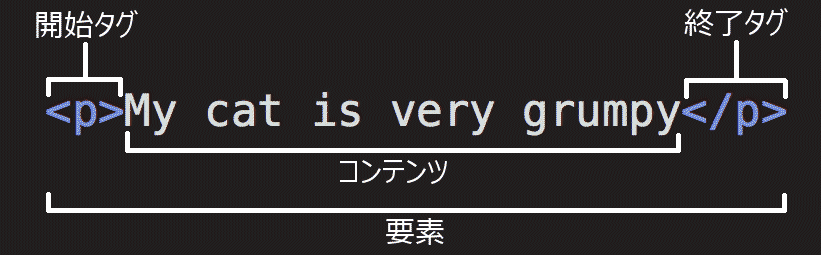
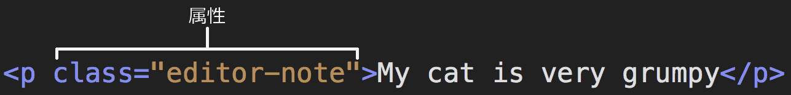
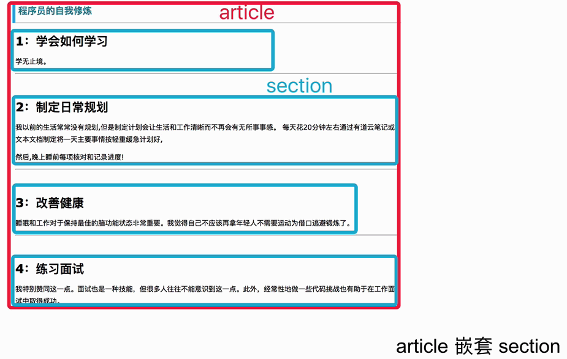

# HTML study

[HTML 基礎学習サイト](https://developer.mozilla.org/zh-CN/docs/Learn/Getting_started_with_the_web/HTML_basics "HTML 基礎学習サイトPage")

## HTML 要素の中身



1. **開始タグ (opening tag)**: これは、要素の名前（この場合は p）を山括弧で囲んだものです。どこから要素が始まっているのか、どこから効果が始まるのかを表します。 — 今回の場合どこから段落が始まるかを表しています。
2. **終了タグ (closing tag)**: これは、要素名の前にスラッシュが入っていることを除いて開始タグと同じです。どこで要素が終わるのかを表しています。  
3. **コンテンツ (content)**: 要素の内容です。今回の場合はただのテキストです。
4. **要素 (element)**: 開始タグ、終了タグ、コンテンツで要素を構成します。

### 要素の属性



属性には、実際のコンテンツには表示させたくない、要素に関する追加情報が含まれています。  
ここでは、 `class` が属性の名前で、 `editor-note` が属性の値です。

### 要素の入れ子（嵌套元素）

```html
<p>My cat is <strong>very</strong> grumpy.</p>
```

### 空要素

```html

```
この要素は 2 つの属性を持っていますが、終了タグ `</img>` がありませんし、内部にコンテンツもありません。

## HTML 文書の構造

**`!`で生成可能。**

```html
<!doctype html>
<html lang="ja">
  <head>
    <meta charset="utf-8" />
    <meta name="viewport" content="width=device-width" />
    <title>テストページ</title>
  </head>
  <body>
    
  </body>
</html>
```
1. `<!DOCTYPE html>`  
   文書型宣言です。これは必須の前置きです。昔々、 HTML がまだ出来たばかりの頃（1991 ～ 2 年）、文書型宣言は HTML ページが正しい HTML と見なされるために従わなければならない、一連のルールへのリンクとして機能することを意味していました。つまり、自動エラーチェックなどの有益なものを表すことができました。しかし、最近ではあまり機能しておらず、文書が正しく動作するために必要なだけです。今はこれだけ知っていれば大丈夫です。

2. `<html></html>`  
   `<html>` 要素です。この要素は、このページのすべてのコンテンツを囲み、ルート要素と呼ばれることもあります。ここでは文書の主要な言語を設定する lang 属性も指定します。

3. `<head></head>`  
   `<head>` 要素です。この要素は、ページの閲覧者に向けて表示するためのコンテンツではない、 HTML ページに含めたいものをすべて収めるための入れ物です。検索エンジン向けの キーワード やページのディスクリプション（説明書き）、ページの見た目を変更するための CSS、文字コードの宣言などを含みます。

4. `<meta charset="utf-8">`  
   この要素は、大部分の書き言葉の文字のほとんどを含む UTF-8 を文書で使用するように設定しています。基本的には、文書はどんなテキストコンテンツでも扱えるようになります。これを設定しない理由はありませんし、後でいくつかの問題を回避するのに役立ちます。

5. `<title></title>`  
   `<title> `要素です。ページのタイトルを指定しています。このタイトルはページが読み込まれた時にブラウザーのタブに表示されます。また、ブックマークやお気に入りに登録した時の説明にも使われます。

6. `<meta name="viewport" content="width=device-width">`  
   このビューポート属性は、このページがある幅のビューポートで描画されることを保証し、モバイルブラウザーがビューポートより広い幅でページを描画した上で縮小して表示するのを防止します。
   
7. `<body></body>`  
   ` <body>` 要素です。これには、テキスト、画像、ビデオ、ゲーム、再生可能な音声トラックなど、ページを訪れたウェブの利用者に表示したいすべてのコンテンツが含まれます。

## テキストのマークアップ（标记文本）

### HTML コメント
```html
<!-- コメント -->
```

### 画像

```html

```
- 画像ファイルのパスを値に持つ src (**s**ou**rc**e) 属性を指定する。
- alt (**alt**ernative; 代替) 属性も指定しています。

### 見出し
```html
<!-- 4 段階の見出し -->
<h1>メインタイトル</h1>
<h2>最上位の見出し</h2>
<h3>小見出し</h3>
<h4>孫見出し</h4>
```

### 段落
```html
<p>This is a single paragraph</p>
```

### リスト

1. **順序なしリスト**は、お買い物リストのようにアイテムの順番が特に関係ない時に使います。順序なしリストは `<ul>` 要素で囲みます。  
   リストの中に入るそれぞれのアイテムは `<li>` (list item) 要素の中に書きます。
```html
<p>At Mozilla, we're a global community of</p>

<ul>
    <li>technologists</li>
    <li>thinkers</li>
    <li>builders</li>
</ul>

<p>working together…</p>
```

<div align=center></div>

2. **順序付きリスト**は料理のレシピのようにアイテムの順番が関係ある時に使います。順序付きリストは `<ol>` 要素で囲みます。  
   リストの中に入るそれぞれのアイテムは `<li>` (list item) 要素の中に書きます。
```html
<p>At Mozilla, we're a global community of</p>

<ol>
    <li>technologists</li>
    <li>thinkers</li>
    <li>builders</li>
</ol>

<p>working together…</p>
```

<div align=center></div>

### リンク

- リンクを追加するには、シンプルな要素 `<a>` を使う必要があります。 a は "anchor" を省略したものです。  
- `href` は **h**ypertext **ref**erence を表しています。

```html
<a href="https://www.mozilla.org/en-US/about/manifesto/">
  Mozilla Manifesto
</a>
```

## 文書とウェブサイトの構造

`<body>`内編集

- ヘッダー（页眉）: `<header>`。
- ナビゲーションバー（导航栏）: `<nav>`。
- メインコンテンツ（主内容）: `<main>`。  
   `<main>` はページごとに 1 回だけ使用し、 `<body>` の中に直接入れてください。
   `<article>`、`<section>`、`<div>` 要素で表されるさ まざまなコンテンツサブセクションを含みます。  
- サイドバー（侧边栏）: `<aside>`。  
   `<main>` の中に置かれることがよくあります。
- フッター（页脚）: `<footer>`。

### HTML レイアウト要素の詳細
1. `<article>`  
   ページの残りの部分（例えば、単一のブログ記事）なしでそれ自体が意味をなす関連コンテンツのブロックを囲みます。
   > 包围的内容即一篇文章，与页面其他部分无关（比如一篇博文）。

2. `<section>`  
   <font color = red>必ずH1があります。</font>  

   `<article>` に似ていますが、1 つの機能（例：ミニマップ、記事の見出しと要約のセット）を構成するページの単一部分をグループ化するためのものです。各セクションを見出しで始めるのがベストプラクティスです。文脈に応じて、`<article>` を異なる `<section>` に、または `<section>` を異なる `<article>` に分割することもできます。  

   > 与 `<article>` 类似，但 `<section>` 更适用于组织页面使其按功能（比如迷你地图、一组文章标题和摘要）分块。一般的最佳用法是：以标题作为开头；也可以把一篇 `<article>` 分成若干部分并分别置于不同的 `<section>` 中，也可以把一个区段 `<section>` 分成若干部分并分别置于不同的 `<article>` 中，取决于上下文。



### 意味的ではないラッパー

1. `<div>`  
   `div` は複数の要素をまたがって範囲指定を行い一つにまとめるタグです。  
   `div` の `display`プロパティは `block` ですので、`display` プロパティが `block` の要素でも `inline` の要素でもまとめて一つの要素として扱うことが出来ます。

2. `<span>`  
   `span` は複数の要素をまたがって範囲指定を行い一つにまとめるタグです。  
   `span` の `display`プロパティは `inline` ですので、`display` プロパティが `block` の要素は `span` の範囲内に含めることはできません。  
   `display` プロパティが `inline` の要素のみを含めて範囲指定し、まとめて一つの要素として扱うことが出来ます。

   また `span` の `display` はプロパティは `inline` ですので、`span` 要素の**前後に改行が行われません**。  
   ですので文中の一部のスタイルを細かく設定するのに適しています。

### 改行と水平線

1. `<br>`: 改行要素

2. `<hr>`: 主題分割要素  
   視覚的には単に横線のように見えます。