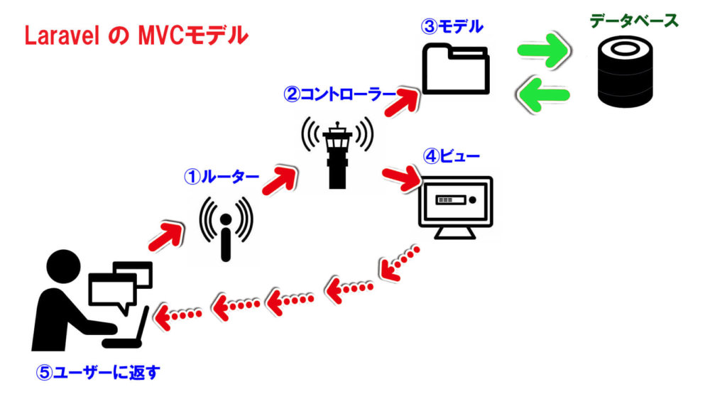
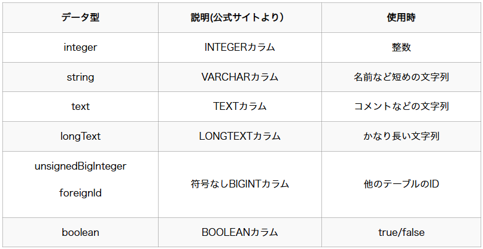
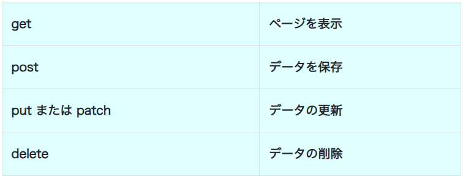
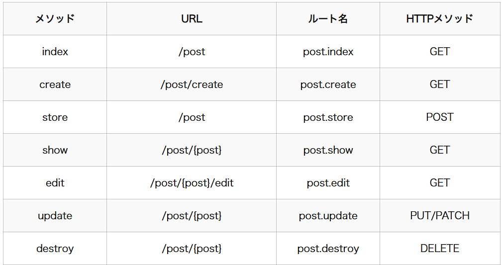
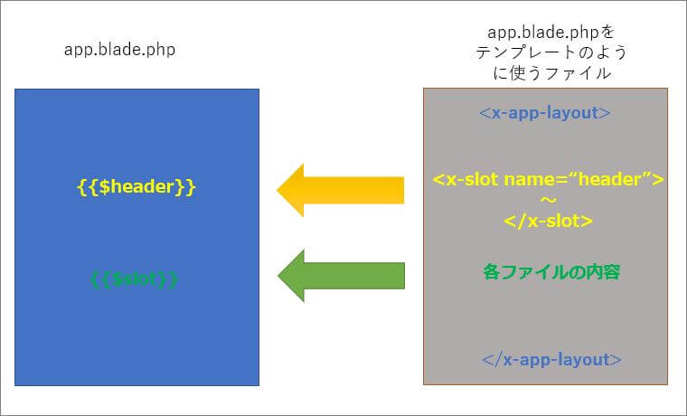

# Laravel 学習

MVCモデル


## 1. modles と DB の作成

### 1.1 modle 作り方

- app -> Models  
  
  <font color=tomato>创建模型</font>  
  ここで，`post.php`を例として扱う．

    ```sh
    # モデルファイル & マイグレートファイルの作成
    php artisan make:model Post -m
    '''
    最後に-mを入れることで、モデルファイル作成時に、マイグレートファイルも同時に作成できます。
    マイグレーションファイルは、データベーステーブルの内容を設定するためのファイルです。
    databaseフォルダの中に作成されます。【本日の日付_create_posts_table.php】
    '''
    ```

    <font color=tomato>定义模型</font>  
    模型类通常继承自 Illuminate\Database\Eloquent\Model。
    ```php
    <?php
    namespace App\Models;
    use Illuminate\Database\Eloquent\Model;

    class Post extends Model
    {
        // 模型代码
    }
    ```

- 「マイグレーションファイル」の編集    
  database -> migrations  
  Eloquent将默认使用<font color=tomato>**复数形式的类名作为数据库表名**</font>

  > up 方法定义了迁移中要执行的操作，而 down 方法定义了回滚迁移时要执行的操作。

    ```php
    class Post extends Model
    {
        public function up()
        {
            Schema::create('posts', function (Blueprint $table) {
                $table->id();
                $table->string('title');
                $table->text('body');
                $table->text('image')->nullable(); # 入力なくでもOK
                $table->timestamps();
            });
        }

        public function down()
        {
            Schema::dropIfExists('posts');
        }
    }
    ```

    Laravelのデータ型
    

- Laravel のマイグレーションファイルの内容がデータベースに反映  
  データベースに反映（移行）  
  <font color=tomato>数据库迁移</font>
    ```sh
    # 移行
    php artisan migrate
    ```

---

### 1.2 データベースロールバック

```sh
# ロールバック
php artisan migrate:rollback
```

---

### 1.3 Eloquent ORM エンジン --- Modelsの編集

**マイグレーションファイルでデータベースを操作する方式**   
**Eloquent 模型基础操作**

モデルクラスでは`クラス名::メソッド()`のように記述してクリエビルダでデータベースを操作します。

>用于简化数据库操作。Eloquent允许你使用模型类与数据库表进行交互，每个模型类通常对应一个数据库表。  
Eloquent 提供了一些基本的数据库操作方法，如创建、读取、更新和删除（CRUD）。

1. 创建数据  
    你可以使用模型的 `create` 方法来插入数据。确保在模型中定义 `fillable` 属性，以防止批量赋值漏洞：
    ```php
    <?php
    namespace App\Models;
    use Illuminate\Database\Eloquent\Model;

    class Post extends Model
    {
        protected $fillable = ['title', 'body', 'author_name'];

        <!-- Modelの下はリレーションの構築 -->
        #public function user()
        #{
        #    return $this->belongsTo(User::class, 'user_id');
        #}
    }
    ```

2. 读取数据  
   你可以使用模型的 `all` 方法读取所有数据：
   >`SELECT * FROM sample`のSQL文と同じ内容です。
    ```php
    $posts = Post::all();
    ```
    或使用 `find` 方法按主键查找数据
    >`SELECTION * FROM sample where id =: primary`のSQL文と同じような内容です。
    ```php
    $post = Post::find(1);
    ```
    还可以使用查询构建器方法：
    ```php
    $posts = Post::where('title', 'First Post')->get();
    ```
    还可以查询特定的值：  
    `get('カラム名', '値')`
    `>SELECTION * FROM sample where name =: 'name'`のSQL文と同じ内容です。
    ```php
    $posts = sample::where($request->name)->get();
    ```

3. 更新数据  
   你可以使用模型实例的 `save` 方法来更新数据：
    ```php
    $post = Post::find(1);
    $post->title = 'Updated Post Title';
    $post->save();
    ```
   或者使用 `update` 方法：
    ```php
    Post::where('id', 1)->update(['title' => 'Updated Post Title']);
    ```

4. 删除数据  
   你可以使用模型实例的 `delete` 方法来删除数据：
    ```php
    $post = Post::find(1);
    $post->delete();
    ```
    或者使用 `destroy` 方法按主键删除数据：
    ```php
    Post::destroy(1);
    ```

---

### 1.4 リレーションの構築

`デル間で関係を作る -> 模型关系`  
<font color = red>两个表都要做编辑</font>

Eloquent 提供了多种类型的模型关系，包括一对一、一对多和多对多关系。

1. 一对一关系  
   一对一关系是指一个模型对应另一个模型。例如，一个用户有一个手机号码。  

    创建相关模型：
    ```sh
    php artisan make:model User -m
    php artisan make:model Phone -m
    ```
    定义迁移：  
    - `User.php` のマイグレーションファイル

        ```php
        class CreateUsersTable extends Migration
        {
            public function up()
            {
                Schema::create('users', function (Blueprint $table) {
                    $table->id();
                    $table->string('name');
                    $table->timestamps();
                });
            }

            public function down()
            {
                Schema::dropIfExists('users');
            }
        }
        ```
    - `phone.php` のマイグレーションファイル

        ```php
        class CreatePhonesTable extends Migration
        {
            public function up()
            {
                Schema::create('phones', function (Blueprint $table) {
                    $table->id();
                    $table->string('phone_number');
                    $table->foreignId('user_id')->constrained()->onDelete('cascade');
                    $table->timestamps();
                });
            }

            public function down()
            {
                Schema::dropIfExists('phones');
            }
        }
        ```

        <font color = tomato>
        特に、`phone.php`のマイグレーションファイルに

        > $table->foreignId('user_id')->constrained()->onDelete('cascade');  

         - $table  
           代表当前正在定义的表格。

         - foreignId('user_id')  
           表示创建一个外键字段。指定这个外键字段的名称为'user_id'

         - ->constrained()  
           这个方法用于指定外键所引用的目标表格。  
           默认情况下，它会尝试引用一个与外键字段同名的表格（例如 users）。
           也可以手动指定目标表格，比如 ->constrained('users')。

         - ->onDelete('cascade')  
           这个方法用于定义当被引用表格中的记录被删除时，当前表格中的关联记录应该采取的动作。  
           'cascade'：表示当<u>父表（users 表）</u>中的记录被删除时，<u>子表（当前表格）</u>中所有引用该父表记录的子记录也将被级联删除。

        </font>  

    运行迁移：
    ```sh
    php artisan migrate
    ```

    <font color = pink>
    两个表都要做编辑<br>
    父表 hasOne 子表<br>
    子表 belongsTo 父表
    </font>  

    ---
    在 `User` model 中定义关系：
    ```php
    namespace App\Models;

    use Illuminate\Database\Eloquent\Model;

    class User extends Model
    {
        public function phone()
        {
            return $this->hasOne(Phone::class);
        }
    }
    ```

    在 `Phone` model 中定义关系：
    ```php
    namespace App\Models;

    use Illuminate\Database\Eloquent\Model;

    class Phone extends Model
    {
        public function user()
        {
            return $this->belongsTo(User::class);
        }
    }
    ```

2. 一对多关系  
    一对多关系是指一个模型对应多个模型。例如，一个博客文章有多个评论。

    <font color = pink>
    两个表都要做编辑<br>
    父表 hasMany 子表<br>
    子表 belongsTo 父表
    </font>  
    
    ---
    在 `Post` model 中定义关系：
    ```php
    namespace App\Models;

    use Illuminate\Database\Eloquent\Model;

    class Post extends Model
    {
        public function comments()
        {
            return $this->hasMany(Comment::class);
        }
    }
    ```

    在 `Comment` model 中定义关系：
    ```php
    namespace App\Models;

    use Illuminate\Database\Eloquent\Model;

    class Comment extends Model
    {
        public function post()
        {
            return $this->belongsTo(Post::class);
        }
    }
    ```

3.  多对多关系  
   多对多关系是指多个模型对应另一个多个模型。例如，一个学生可以参加多个课程，一个课程可以有多个学生。

    创建相关模型：
    ```sh
    php artisan make:model Student -m
    php artisan make:model Course -m
    php artisan make:migration create_course_student_table --create=course_student
    ```
    定义迁移：  
    - `Student.php` のマイグレーションファイル

        ```php
        class CreateStudentsTable extends Migration
        {
            public function up()
            {
                Schema::create('students', function (Blueprint $table) {
                    $table->id();
                    $table->string('name');
                    $table->timestamps();
                });
            }

            public function down()
            {
                Schema::dropIfExists('students');
            }
        }
        ```
    - `Course.php` のマイグレーションファイル

        ```php
        class CreateCoursesTable extends Migration
        {
            public function up()
            {
                Schema::create('courses', function (Blueprint $table) {
                    $table->id();
                    $table->string('title');
                    $table->timestamps();
                });
            }

            public function down()
            {
                Schema::dropIfExists('courses');
            }
        }
        ```
    - `course_student.php` のマイグレーションファイル

        ```php
        class CreateCourseStudentTable extends Migration
        {
            public function up()
            {
                Schema::create('course_student', function (Blueprint $table) {
                    $table->id();
                    $table->foreignId('student_id')->constrained()->onDelete('cascade');
                    $table->foreignId('course_id')->constrained()->onDelete('cascade');
                    $table->timestamps();
                });
            }

            public function down()
            {
                Schema::dropIfExists('course_student');
            }
        }
        ```

    运行迁移：
    ```sh
    php artisan migrate
    ```

    <font color = pink>
    两个表都要做编辑<br>
    父表 belongsToMany 子表<br>
    子表 belongsToMany 父表
    </font>  
    
    ---
    在 `Student` model 中定义关系：
    ```php
    namespace App\Models;

    use Illuminate\Database\Eloquent\Model;

    class Student extends Model
    {
        public function courses()
        {
            return $this->belongsToMany(Course::class);
        }
    }
    ```

    在 `Course` model 中定义关系：
    ```php
    namespace App\Models;

    use Illuminate\Database\Eloquent\Model;

    class Course extends Model
    {
        public function students()
        {
            return $this->belongsToMany(Student::class);
        }
    }
    ```

## 2. DB の修正

### 2.1 作成したテーブルの中にカラムを追加する

- app -> Models

    ```sh
    '''
    php artisan make:migration add_column_カラム名_to_テーブル名_table --table=テーブル名
    '''
    php artisan make:migration add_column_user_id_to_posts_table --table=posts
    '''
    databaseフォルダの中に作成されます。【本日の日付 add_column_user_table_to_posts_table.php】
    '''
    ```

- 「マイグレーションファイル」の編集  
  database -> migrations

    ```sh
    public function up()
    {
        Schema::table('posts', function (Blueprint $table) {
            $table->foreignId('user_id')->after('image');
        });
    }
    # unsignedBigIntegerは生成されるカラムは外部のキーとして使わないことである．
    # foreignIdは生成されるカラムは外部のキーとして使うことである．
    ```

- データベースに反映（移行）

    ```sh
    # 移行
    php artisan migrate
    ```

## 3. Controller 

app -> Http => Controllers

>ユーザの操作の流れから  
>
><font color=tomato>アドレスでアクセス -> routes -> Controller -> view -> テンプレ</font>

### 3.1 Controllerの作成
以下のコードで
```sh
php artisan make:controller PostController
```

### 3.2 routesとの連結

routes -> web.php

routesでアドレスの設定および表示されるcontrollerを連結します。


>Route::HTTPメソッド('URL', [コントローラー::class, 'メソッド'])->name('ルート名');

ユーザーが【URL】にアクセスしたら、【コントローラー】の中の【メソッド】を実行する、という意味になります。



- 設定について

    web.phpファイルの上部に、下記のuse宣言を追加してください。

    ```php
    use App\Http\Controllers\PostController;
    ```
    そして、

    ```php
    Route::get('/post', [PostController::class, 'index']);
    ```
    PostControllerのclass内の`'index'`関数を呼び出します。  

- リソースコントローラーのURLとルート名一覧  

### 3.3 Viewsとの連結

app -> Http => Controllers

`'index'`関数内に以下のコードがあるため、viewファイルと連結できます。

```php
// PostController.phpのControllerファイル内
public function index()
{
    $posts = [
    (object)[`title` -> '最初の投稿', 'body' -> 'これは最初の投稿の本文です．'], 
    (object)[`title` -> '二番目の投稿', 'body' -> 'これは二番目の投稿の本文です．'], 
    ];
    return view('posts.index', ['myposts' => $posts])   #ここ!!!
}

// 1. View/posts/index.blade.php のViewファイル利用
// 2.  Controllerファイル内の$posts変数をView/posts/index.blade.php のViewファイル内の$myposts変数に代入
```
`$posts`は`object`にした方がいい？  
同時に、viewファイルに`$posts`の変数を利用したいため、以下のように扱います。
```php
{{$myposts -> title}}
```
Controllerファイル内の`object`属性の`$posts`の変数である`title`に対応する`'最初の投稿'`の値を呼び出すことができます。

## 4. Views

resources -> views  

**blade エンジンのため，ファイルの拡張子は html ではなく，【.blade.php】とします．**  
**ただし，HTML & Tailwind css で修正**

### 4.1 テンプレートの作成

resources -> views -> layouts

viewファイルと同じ、`.blade.php`ファイルです。  
共通で使いたい部品を作ります。

- 新しい`.blade.php`ファイルで，`!` マークで基本的フォーマットの作成は可能

#### 4.1.1 テンプレの実装
resources/views/layouts/app.blade.phpのテンプレを作ったら，viewファイルに運用したい時，viewファイルの第１行に
```php
@extends('layouts.app')
```
で導入し，
```php
@section('title')
'内容'

または

@section('title', '内容')
```
などの形でresources/views/layouts/app.blade.phpのテンプレの
```php
@yield('title')
```
の部分に代入する意味です。

---

または  
Viewファイルに

```php
<x-app-layout> 

<x-slot name='header'>
内容1
</x-slot>
内容2

</x-app-layout>
```
のように，`<x-app-layout>`範囲内の内容をresources/views/layouts/app.blade.phpのテンプレを運用する意味です。  
特に，app.blade.phpのテンプレに  
`{{$slot}}`を`<x-slot name='header'>`のような囲まれていない`内容2`をテンプレに代入し，  
`{{$header}}`に`<x-slot name='header'>`のように名前を付けた部分の`内容1`の内容をテンプレに代入することを意味します。



### 4.2 コンポーネントの作成（テンプレと同じ扱う？）

app -> view/omponents  
resources -> views -> components

```sh
php artisan make:component 名前
```
